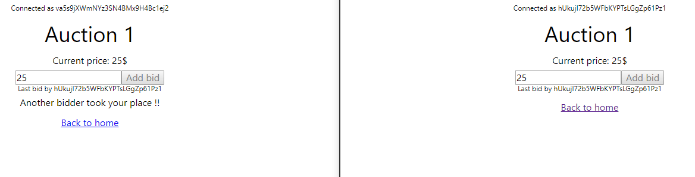

# Auction-poc

Auction PoC app with React.

## Stack

This project was bootstrapped with [Create React App](https://github.com/facebook/create-react-app).

[Firebase](https://firebase.google.com/docs/) is used for user authentication, and real time database.

[React-router](https://github.com/ReactTraining/react-router) is used for browser routing.

## How to run ?

Before runnign the application, create a copy of `config.template.json` and rename it `config.json`. You should used your own firebase credentials ([check here](https://firebase.google.com/docs/web/setup)).

    npm install
    npm run start

Access to http://localhost:3000 to use the app.
